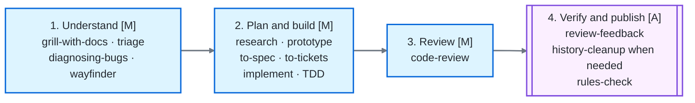

# An Evidence-Guided Agent Development Workflow

This guide combines [Matt Pocock's open-source skill set](https://github.com/mattpocock/skills) with the verification-oriented skills in agent-methods.
Many thanks to Matt Pocock and the project contributors.
They created an excellent collection of practical development methods.
Their skills provide the planning, research, implementation, and review foundation for the workflow below.

Use the combined workflow to move from an uncertain request to a verified result.
Matt Pocock's skills move the work through discovery and implementation.
The agent-methods skills add evidence, approval gates, completion checks, and release discipline.

## In this guide

- Start with [Quick start](#quick-start) and the [Default flow](#default-flow).
- Use [Skill roles](#skill-roles) and [Phase handoffs](#phase-handoffs) as references during a task.
- Choose a route from [Common paths](#common-paths).
- Follow the [worked example](#worked-example-add-a-retry-cap) to see the decisions and evidence in context.
- Apply the [best practices](#best-practices-and-integration-rules) before publication.
- Review the [project setup](#project-setup) guidance when adopting the workflow.

## Quick start

Choose the shortest path that preserves the checks your change needs.
Name the skill in each request so the agent knows which method and stop conditions to follow.

For a small feature, use one request at a time:

1. Clarify the request.

   ```text
   Use grill-with-docs to clarify this feature request.
   Record the decisions, constraints, and unresolved questions before implementation.
   ```

2. Implement the agreed behavior.

   ```text
   Implement the agreed change with TDD.
   Start with a focused failing test and report the checks you run.
   ```

3. Review the result.

   ```text
   Run code-review against <base> and the agreed requirements.
   Return the Standards and Spec findings without applying them.
   ```

4. Handle the review findings.

   ```text
   Use review-feedback to assess every finding in <review-report>.
   Address the supported findings and verify each remedy.
   ```

5. Check the final state before publication.

   ```text
   Use rules-check to verify the final commits, worktree, approvals, and required checks.
   Do not push or release unless I authorize that action.
   ```

Replace `<base>` with the integration branch or commit and `<review-report>` with the review artifact.
Pause between requests when the previous skill produces a decision or asks for approval.
For large work, insert `to-spec` and `to-tickets` between clarification and implementation.

## Skill roles

Use Matt Pocock's skills to shape and execute the work:

- **Clarify:** `grill-with-docs` and `domain-modeling` define the problem and record decisions.
- **Design and investigate:** `codebase-design` sets module boundaries and testing seams.
  Use `research` and `prototype` to resolve uncertainty.
- **Plan and build:** `to-spec` and `to-tickets` structure large work.
  Use `implement` and `tdd` to deliver vertical slices.
- **Review:** `code-review` checks repository standards and the originating specification.
- **Choose another entry point:**
  - `diagnosing-bugs` handles difficult bugs.
  - `triage` evaluates incoming issues.
  - `wayfinder` maps broad efforts.
- **Cross session or Git boundaries:** `handoff` transfers context, and `resolving-merge-conflicts` handles conflicts.

Use agent-methods to govern evidence and completion:

- [`review-feedback`](../skills/review-feedback/SKILL.md) assesses each review finding before the agent changes code.
  It tracks supported findings through verification.
- [`progress-check`](../skills/progress-check/SKILL.md) accounts for started background work.
  It covers jobs, subagents, monitors, and delegated runs.
- [`history-cleanup`](../skills/history-cleanup/SKILL.md) proposes reviewable commit groups.
  It requires approval before rewriting history.
- [`rules-check`](../skills/rules-check/SKILL.md) checks the final Git state and session evidence.
  It compares both against the applicable agent rules.

## Default flow

Choose the entry point that matches the request, then join the main path when the problem is clear.

Blue `[M]` nodes mark Matt Pocock skills.
The purple `[A]` node marks agent-methods skills.



Read the diagram from left to right:

- Choose one entry skill in the Understand stage.
- Use `research` or `prototype` when uncertainty remains in Plan and build.
- Add `to-spec` plus `to-tickets` for large work.
- Continue through `code-review`, feedback assessment, an optional history cleanup, and a final rules check.

`progress-check` sits beside this flow rather than inside it.
Use it before a phase transition or completion claim when the session started background work.

## Phase handoffs

Each phase should produce evidence that the next phase can consume.

| Phase | Skills | Exit evidence |
| --- | --- | --- |
| Clarify the request | `grill-with-docs`, `domain-modeling` | The team records decisions, domain terms, constraints, and open questions. |
| Design the change | `codebase-design` | The team defines public interfaces, module boundaries, and testing seams. |
| Resolve uncertainty | `research`, `prototype` | Primary-source findings or prototype results support a concrete decision. |
| Plan large work | `to-spec`, `to-tickets` | The specification defines testable outcomes, and tickets form useful vertical slices with explicit dependencies. |
| Implement | `implement`, `tdd` | The agent takes each slice through red, green, and refactor with focused verification. |
| Review | `code-review` | The review report keeps standards findings and specification findings separate and traceable. |
| Handle findings | `review-feedback` | The agent records a judgment, remedy, progress state, and verification result for each finding. |
| Reconcile background work | `progress-check` | The report accounts for every started task as complete, active, failed, or proposed for an approved stop. |
| Prepare history | `history-cleanup` | Commits form coherent groups, the user approved any rewrite, and verification confirms tree equality. |
| Check process compliance | `rules-check` | The final commits, worktree, checks, approvals, and session actions satisfy repository rules. |
| Transfer context | `handoff` | The next session receives artifact references, current state, and unresolved decisions. |

## Common paths

### Small feature

```text
grill-with-docs
  -> implement with TDD
  -> code-review
  -> review-feedback
  -> rules-check
  -> push or open a pull request
```

### Multi-ticket feature

```text
grill-with-docs
  -> to-spec
  -> to-tickets
  -> implement each ticket
  -> progress-check when work runs in parallel
  -> code-review across the complete feature
  -> review-feedback
  -> history-cleanup when needed
  -> rules-check
  -> open a pull request
```

### Difficult bug

```text
diagnosing-bugs
  -> create a tight loop that can reproduce the failure
  -> add a regression test
  -> implement the fix
  -> code-review
  -> review-feedback
  -> rules-check
```

### Broad or unclear effort

Start with `wayfinder` to map the problem and identify a tractable route.
Join the main flow at `to-spec` once the scope and dependencies are clear.
Avoid jumping from a broad map into implementation without a testable specification.

### Incoming issue

Use `triage` to assess an external issue before accepting it as development work.
Tickets created from an approved specification have passed that decision point.
Send them to implementation without another triage pass.

## Worked example: add a retry cap

Suppose an API client retries failed requests without a limit.
You want a configurable retry cap while preserving the current public API.

1. **Clarify with `grill-with-docs`.**
   The request leaves the default, maximum, and compatibility behavior open.
   The team chooses a default of three attempts, rejects negative values, and preserves existing call sites.
2. **Design the seam with `codebase-design`.**
   The retry loop mixes policy with network I/O.
   The agent defines a small retry-policy seam that tests can exercise without making requests.
3. **Choose the small-change path.**
   The change has one boundary and does not need multiple tickets.
   The agent skips `to-spec` and records the decision in the task notes.
4. **Implement with `tdd`.**
   Boundary behavior needs executable proof.
   A failing test covers the fourth attempt, then the implementation makes it pass without changing existing tests.
5. **Review with `code-review`.**
   The completed change needs standards and specification checks.
   The review separates a naming concern from a finding that the cap is missing on one retry path.
6. **Assess findings with `review-feedback`.**
   The two findings need evidence-based judgments.
   The agent records the naming comment as unsupported, fixes the missing cap, and reruns the focused tests.
7. **Check the final state with `rules-check`.**
   The final state must satisfy repository instructions.
   The report accounts for lint, tests, `git diff --check`, commit messages, approvals, and worktree state.

For one focused change, proceed without ticket decomposition or history cleanup.
A wider feature might change persistence, observability, and several public APIs.
In that case, use `to-spec` and `to-tickets` before implementation.

## Best practices and integration rules

| Situation | Avoid | Prefer |
| --- | --- | --- |
| Selecting a path | Invoke every available skill. | Choose the shortest path that preserves the required evidence and approvals. |
| Handling review | Apply every comment as an instruction. | Assess each finding with `review-feedback` before editing. |
| Tracking background work | Claim completion while started tasks remain unaccounted for. | Record task handles at launch and run `progress-check` before the next phase. |
| Cleaning history | Rewrite commits as an automatic finishing step. | Propose exact commit groups and wait for approval. |
| Checking rules | Run `rules-check` before rewriting history. | Run it after the final commit structure and worktree are stable. |

### Operational rules

1. Route review findings through `review-feedback`.
   Use `code-review -> review-feedback -> commit` so the agent evaluates evidence before changing code.
   A reviewer's confidence does not replace assessment against the repository and the requested behavior.
2. Request another review pass for feedback changes that affect a high-risk interface, invariant, or security boundary.
   A narrow confirmation pass is enough for most follow-up changes.
3. Invoke `progress-check` when background work exists.
   Record each task's handle, purpose, expected end, and output location when it starts.
   The later check can reconcile that record with runtime evidence.
4. Treat `history-cleanup` as an optional publication step.
   Use it for WIP, fixup, retry, or partial commits, and wait for approval before any history rewrite.
5. Run `rules-check` after the final history is stable.
   If a cleanup rewrites commits, check the rewritten history rather than relying on evidence tied to the old commits.
6. Confirm the testing seam during design or specification work.
   Implementation can then start with a focused failing test instead of reopening the same design question.
7. Use `handoff` at a real session boundary.
   Point to specifications, tickets, reports, and test output instead of copying large blocks of context into the handoff.

## Project setup

Install the skills you plan to use from both [Matt Pocock's repository](https://github.com/mattpocock/skills) and [agent-methods](../README.md#install).
Skill availability and invocation syntax depend on the host agent.
Confirm that each installed skill loads in a new session.

Several planning skills benefit from project-specific agent documentation.
Add these files when the corresponding workflow needs them:

- `docs/agents/domain.md` for shared domain language.
- `docs/agents/issue-tracker.md` for issue and ticket conventions.
- `docs/agents/triage-labels.md` for repository-specific triage decisions.

Keep those documents short and current.
Give the agent project facts instead of asking it to guess.

Start with these minimal entries:

```text
docs/agents/domain.md
  Retry attempt: one request after the initial failure.
  Retry cap: the maximum number of retry attempts.

docs/agents/issue-tracker.md
  Tracker: GitHub Issues
  Required ticket fields: outcome, acceptance criteria, dependencies

docs/agents/triage-labels.md
  accepted: ready for specification or implementation
  needs-information: a reporter must answer a blocking question
  declined: evidence does not support repository action
```

Replace these entries with the terms, tracker rules, and labels that the project uses.

## Tailor the flow to the risk

- For a small, well-understood change, skip research, prototyping, ticket decomposition, and history cleanup.
- For a large or uncertain change, require explicit handoffs and evidence.
- Preserve the remaining gates in both cases: clarify, test, review, assess, verify, and publish.

The workflow does not need a single orchestration skill.
Point a short project rule at this guide.
Each focused skill retains its own trigger, evidence boundary, approval gate, and stop condition.
